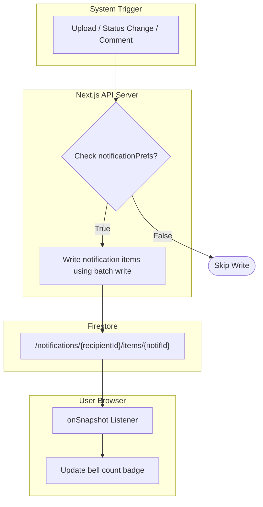

# KraftDesk — API Endpoints & Notification System

This document contains a comprehensive reference of the backend API routes and the architecture of the real-time, in-app notification system.

---

## 1. API Authentication & Headers

Every API route inside KraftDesk requires the caller to be authenticated.
- **Header format**: `Authorization: Bearer <Firebase_ID_Token>`
- **Token Verification**: The backend retrieves the ID token, decrypts it, and verifies it against Google's Firebase Authentication servers using `adminAuth.verifyIdToken(idToken)`.
- **Response if missing or invalid**: Returns a `401 Unauthorized` JSON payload.

---

## 2. API Endpoint Reference

### 1. Cloudinary Upload Signer
Generates a timestamped signature for secure browser-to-Cloudinary uploads.

* **Route**: `/api/cloudinary/sign`
* **Method**: `POST`
* **Request Body**: None (Required: `Authorization` Header)
* **Response (200 OK)**:
  ```json
  {
    "signature": "81f1816bc88e1781223e7f...",
    "timestamp": 1782294100,
    "apiKey": "48182937582910"
  }
  ```

---

### 2. Protected Poster Download
Generates the un-watermarked high-resolution download link after authorization checks.

* **Route**: `/api/posters/[id]/download` (where `[id]` is the Firestore poster ID)
* **Method**: `GET`
* **Response (200 OK)**:
  ```json
  {
    "secureUrl": "https://res.cloudinary.com/.../clean-poster-file.png"
  }
  ```
* **Error Response (403 Forbidden)**: If the caller is not the owner and does not have the reviewer or admin role.
  ```json
  {
    "error": "You don't have permission to download this poster."
  }
  ```

---

### 3. Poster Status Mutator
Handles transition updates for reviews (Approve, Request Changes, Reject) and publishing.

* **Route**: `/api/posters/[id]/status`
* **Method**: `POST`
* **Request Body**:
  ```json
  {
    "status": "approved", // approved | changes_requested | rejected | published
    "commentText": "Looks good, just tweak the header text size." // optional, required if status is changes_requested or rejected
  }
  ```
* **Response (200 OK)**:
  ```json
  {
    "ok": true
  }
  ```
* **Logic flow**:
  1. Verifies that the user role permits this update (Reviewer/Admin can approve/request changes/reject; Admin or approved owner can publish).
  2. If status is `published`, computes the clean, un-watermarked `previewUrl` by stripping watermark params and sets `publishedAt`.
  3. Updates the poster document fields `status`, `reviewedBy`, and `updatedAt`.
  4. If a review comment is provided, creates a document in the comments subcollection `/posters/{id}/comments`.
  5. Triggers `notifyOnStatusChange` to notify the designer.

---

### 4. Post Comment
Saves feedback on a poster and alerts the other party.

* **Route**: `/api/posters/[id]/comments`
* **Method**: `POST`
* **Request Body**:
  ```json
  {
    "text": "Please double-check the font contrast."
  }
  ```
* **Response (200 OK)**:
  ```json
  {
    "ok": true
  }
  ```
* **Logic flow**:
  1. Saves the comment inside `/posters/{id}/comments` with `authorId`, `authorRole`, and `text`.
  2. Triggers `notifyOnComment` to notify the other party.

---

### 5. Submit Poster Review Alert
Fans out notifications to reviewers when a designer submits a poster.

* **Route**: `/api/posters/notify-submission`
* **Method**: `POST`
* **Request Body**:
  ```json
  {
    "posterId": "abc123xyz",
    "title": "Summer Campaign Poster"
  }
  ```
* **Response (200 OK)**:
  ```json
  {
    "ok": true
  }
  ```

---

## 3. Real-Time In-App Notification System

KraftDesk uses Firestore subcollections to implement a real-time notification system.



### Client Listener
- When logged in, the client UI starts a Firestore subscription inside [`lib/notifications.ts`](file:///c:/Users/JOSHUA%20ZAZA/Downloads/kraftdesk/lib/notifications.ts):
  ```typescript
  query(collection(db, "notifications", uid, "items"), orderBy("createdAt", "desc"))
  ```
- Any additions or updates to the recipient's notification items immediately update the user's `NotificationBell` state.
- Unread count is calculated client-side by filtering elements where `read == false`.
- Clicking a notification sets `read: true` in Firestore.

### Server Fan-Out & Notification Preferences
The server helper [`lib/notifications-server.ts`](file:///c:/Users/JOSHUA%20ZAZA/Downloads/kraftdesk/lib/notifications-server.ts) manages delivery logic:

1. **Preference Check**: Before writing a notification, the server reads the recipient's document in `/users/{uid}`. If their `notificationPrefs` has disabled the corresponding channel (e.g. `statusChange: false`), the write is skipped.
2. **Reviewer Submission Alert**: When a designer submits a poster for review:
   - Queries all users where `role` is `"reviewer"` or `"admin"`.
   - Uses a Firestore batch write to insert a `"new_submission"` notification document into each matching user's `/notifications/{uid}/items` subcollection.
3. **Comment Notifications (The "Other Party" Rules)**:
   - If a **Designer** comments:
     - If the poster was previously reviewed by someone, that specific reviewer is notified (via `reviewedBy`).
     - If the poster is new and has no reviewer assigned yet, all Reviewers/Admins are notified.
   - If a **Reviewer/Admin** comments:
     - The designer who uploaded the poster is notified (via `uploadedBy`).
