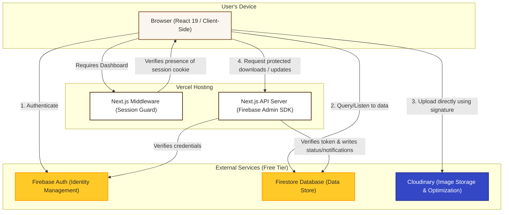

# KraftDesk — System Architecture & Tech Stack

This document describes how KraftDesk is structured, what technologies it runs on, and how the files in this project are organized. It is written to be understandable by both developers inheriting the project and non-programmers who want to understand the design.

---

## 1. High-Level Explanation (What is KraftDesk?)

**KraftDesk** is a Digital Poster Design Management System. Think of it as a specialized, private dashboard where a design team can:
- **Designers**: Upload new poster designs, view feedback, and submit revisions.
- **Reviewers**: Look at submitted designs, comment on them, and approve or request changes.
- **Admins**: Manage categories, update user roles, and publish approved designs to a public gallery.

To keep costs at exactly **$0**, the project utilizes free-tier cloud services that handle authentication, databases, and image hosting.

---

## 2. System Architecture

The following diagram illustrates how the different components of KraftDesk talk to each other:

### How the Data Flows (Simple Upload-to-Publish Lifecycle)
1. **Selection**: A designer selects an image file (PNG/JPG/WebP/PDF).
2. **Authorization**: The browser asks the Next.js API server for a secure timestamped upload signature.
3. **Upload**: The browser uploads the image directly to **Cloudinary** (avoiding Next.js server limits).
4. **Registration**: Once uploaded, the browser saves the image URL and metadata into **Firestore** as a `draft`.
5. **Review**: The designer submits it for review. Reviewers get real-time in-app notifications and view the design with a watermarked preview.
6. **Action**: The reviewer approves the design (or requests changes).
7. **Publishing**: An admin publishes the approved poster, making it public on the un-authenticated Gallery page.

---

## 3. Technology Stack

We chose a modern, performance-focused, and completely free tech stack:

| Technology | Layer / Purpose | Role in KraftDesk | Free-Tier Constraints & Handling |
| :--- | :--- | :--- | :--- |
| **Next.js 15** | Application Framework | Handles page routing, server components, and API routes. | Hosted on **Vercel** (Free: 100GB bandwidth/month). |
| **TypeScript** | Language | Ensures code safety and prevents typos or missing fields. | Purely compilation-time tool, no runtime costs. |
| **Tailwind CSS v4** | UI Styling | Used for layout and theme styles. Configured in Light Mode only. | Light mode is chosen because dark borders around designs alter color perception. |
| **Framer Motion** | UI Animations | Adds card hover lift, status transitions, and progress bar animations. | Runs client-side in the browser. |
| **Firebase Auth** | Authentication | Manages user signups, sign-ins (Email & Google), and passwords. | **Spark Plan**: Unlimited authentications. |
| **Firestore** | Database | Stores structured records (users, categories, comments, notifications). | **Spark Plan**: 1GB storage, 50k reads/20k writes per day. |
| **Cloudinary** | Media Hosting | Hosts the posters and dynamically watermarks and optimizes them. | **Free Plan**: 25 credits/month. **This is our tightest constraint**. We enforce a 10MB limit and load optimized variants (`q_auto,f_auto`). |

---

## 4. Directory & Folder Layout

Here is a simplified layout of the files in the codebase, explaining what each folder does:

- **[`/app`](file:///c:/Users/JOSHUA%20ZAZA/Downloads/kraftdesk/app)**: Contains all the pages and API endpoints. It uses Next.js App Router routing.
  - **[`/(public)`](file:///c:/Users/JOSHUA%20ZAZA/Downloads/kraftdesk/app/(public))**: Pages accessible to anyone (Landing, Gallery, Login, Signup).
  - **[`/(dashboard)`](file:///c:/Users/JOSHUA%20ZAZA/Downloads/kraftdesk/app/(dashboard))**: Pages that require logging in (Dashboard Home, Upload, Posters list, Poster Detail, Review Queue, Categories, Users, Settings).
  - **[`/api`](file:///c:/Users/JOSHUA%20ZAZA/Downloads/kraftdesk/app/api)**: Backend server routes that perform actions needing admin keys (e.g. generating Cloudinary upload signatures, updating poster status, writing notifications).
- **[`/components`](file:///c:/Users/JOSHUA%20ZAZA/Downloads/kraftdesk/components)**: Reusable user interface elements.
  - **[`/ui`](file:///c:/Users/JOSHUA%20ZAZA/Downloads/kraftdesk/components/ui)**: Small, basic UI blocks like buttons, cards, selects, modals, and spinners.
  - **[`/molecules`](file:///c:/Users/JOSHUA%20ZAZA/Downloads/kraftdesk/components/molecules)**: Mid-size components (e.g., Notification Bell, Upload Form, Comment Thread).
  - **[`/organisms`](file:///c:/Users/JOSHUA%20ZAZA/Downloads/kraftdesk/components/organisms)**: Large blocks of page contents (e.g., User management list, Category manager, Public gallery grid).
  - **[`/shells`](file:///c:/Users/JOSHUA%20ZAZA/Downloads/kraftdesk/components/shells)**: Navigation layouts that wrap pages (App navigation sidebar for desktop / bottom tab bar for mobile).
- **[`/lib`](file:///c:/Users/JOSHUA%20ZAZA/Downloads/kraftdesk/lib)**: Shared utility code.
  - `firebase.ts` / `firebase-admin.ts`: Connection code for Firebase (client-side vs. server-side).
  - `cloudinary.ts`: Utilities for uploading files and formatting URLs with watermarks.
  - `auth.ts` / `roles.ts`: Handlers for signing in, signing out, and fetching user permissions.
  - `notifications.ts` / `notifications-server.ts`: Real-time notification updates.
- **[`/types`](file:///c:/Users/JOSHUA%20ZAZA/Downloads/kraftdesk/types)**: TypeScript definitions matching our database fields, ensuring code alignment.
- **[`/firebase`](file:///c:/Users/JOSHUA%20ZAZA/Downloads/kraftdesk/firebase)**: Rules configuration files used to secure our Firestore database on Firebase servers.
- **[`/docs`](file:///c:/Users/JOSHUA%20ZAZA/Downloads/kraftdesk/docs)**: Documentation guides.
