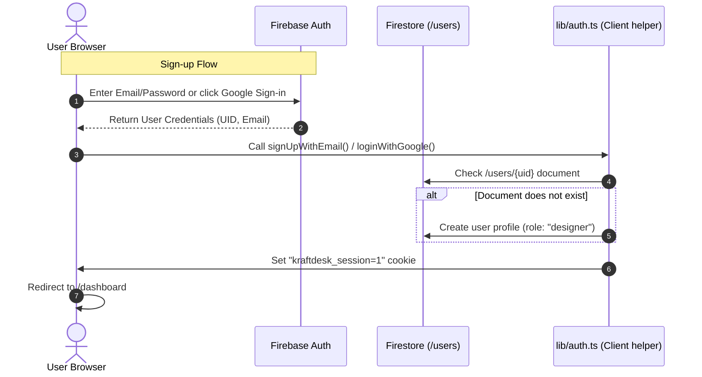

# KraftDesk — Authentication & Access Control (RBAC)

This document details how user accounts, sessions, and access permissions are managed. It covers sign-in/up/out logic, role structures, and developer instructions for bootstrapping admin access.

---

## 1. Authentication Flows

KraftDesk relies on **Firebase Authentication** for credentials management, supporting both traditional Email/Password and Google OAuth sign-in.

### Sign-up Mechanics
1. **Trigger**: The user registers on `/auth/signup` using an email/password or logs in via Google OAuth.
2. **Profile Generation**: The application calls `ensureUserDoc(user)` in [`lib/auth.ts`](file:///c:/Users/JOSHUA%20ZAZA/Downloads/kraftdesk/lib/auth.ts).
3. **Role Gating**: The user's role is hardcoded to `"designer"` on signup.
   - **Important Security Design**: No role selector exists in the signup UI. Users cannot self-escalate to reviewer or admin. This restriction is enforced by Firestore rules.
4. **Cookie Activation**: A lightweight cookie `kraftdesk_session` is set in the user's browser, and they are redirected to `/dashboard`.

### Sign-in Mechanics
- The user logs in via `/auth/login`.
- Upon verification, the `kraftdesk_session` cookie is written to mark active status.

### Log-out Mechanics
- On log-out, the client calls Firebase's `signOut(auth)`.
- The cookie `kraftdesk_session` is cleared (max-age set to 0), prompting Vercel's edge router to block access to dashboard pages.

---

## 2. Session Management & Edge Guards

A common challenge in serverless React applications is gating pages on the server before the page loads. 
- Firebase Auth stores its tokens in **IndexedDB** in the browser. Next.js Edge Middleware cannot inspect IndexedDB.
- **Our Solution**: We set a lightweight, client-writable session cookie called **`kraftdesk_session=1`** on successful authentication.

### How the Middleware Gating Works
When a page under `/dashboard/*` is requested:
1. Vercel's Edge Router runs [`middleware.ts`](file:///c:/Users/JOSHUA%20ZAZA/Downloads/kraftdesk/middleware.ts) *before* rendering the page.
2. The middleware checks for the presence of the `kraftdesk_session` cookie.
3. If the cookie is **missing**, the user is redirected to `/auth/login`, including a `?next=/dashboard/path` query parameter so they are returned to their destination after sign-in.
4. If the cookie is **present**, the page is allowed to load. Real database authorization is then handled inside the page component.

---

## 3. Role-Based Access Control (RBAC)

KraftDesk enforces permissions at both the UI and database levels based on three tiers:

| Action | Designer | Reviewer | Admin | Enforced By |
| :--- | :---: | :---: | :---: | :--- |
| **Upload Poster** | ✅ | ❌ | ❌ | Firestore Rules & UI Gating |
| **Resubmit Own Poster** | ✅ | ❌ | ❌ | Firestore Rules & UI Gating |
| **View Own Posters** | ✅ | ✅ | ✅ | Firestore Reads & UI Gating |
| **View Others' Pending Posters** | ❌ (Watermarked) | ✅ (Full) | ✅ (Full) | UI & Cloudinary transforms |
| **Submit Feedback (Comment)** | ✅ (Own posters) | ✅ (Any) | ✅ (Any) | Firestore rules & UI Gating |
| **Approve / Reject / Request Changes** | ❌ | ✅ | ✅ | API Route & Firestore Rules |
| **Download Original Image (Clean)** | ✅ (Own posters) | ✅ (Any) | ✅ (Any) | Next.js API `/api/posters/[id]/download` |
| **Manage Category Directory** | ❌ | ❌ | ✅ | Firestore Rules & Route Guard |
| **Alter User Permission Roles** | ❌ | ❌ | ✅ | Firestore Rules & Route Guard |

---

## 4. Live Permissions Hook (`useUserRole`)

Rather than fetching role parameters once during login and saving them in an immutable session state, KraftDesk monitors role attributes dynamically in real time:

- The custom hook **`useUserRole`** in [`lib/roles.ts`](file:///c:/Users/JOSHUA%20ZAZA/Downloads/kraftdesk/lib/roles.ts) subscribes to both Firebase's authentication state (`onAuthStateChanged`) and the corresponding profile document in Firestore (`onSnapshot`).
- **Why this matters**: If an Administrator changes a Designer's role to a Reviewer in the database, the user's dashboard view updates immediately in their browser *without* forcing them to log out and log back in.

---

## 5. Bootstrapping the First Administrator Account

Because new accounts are restricted to the `"designer"` role, a newly deployed instance will have no administrators to assign roles. To set up your first admin:

1. Open KraftDesk and navigate to `/auth/signup` to create a new account.
2. Log into your **Firebase Web Console** (https://console.firebase.google.com).
3. Select **Firestore Database** in the sidebar.
4. Find the **`users`** collection and locate the document matching your signup UID.
5. Double-click the **`role`** field, change the value from `"designer"` to **`"admin"`**, and save.
6. Refresh KraftDesk. The sidebar/navigation options for **Queue**, **Categories**, and **Users** will immediately appear.

Once this first admin is configured, they can promote other users directly inside the app on the `/dashboard/users` screen.
