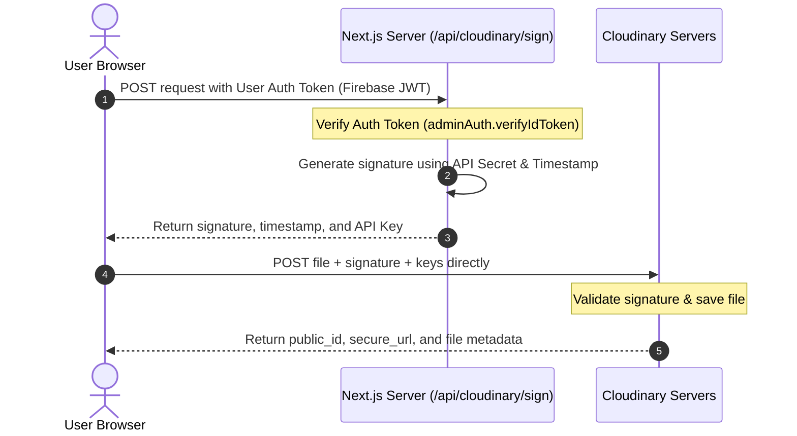

# KraftDesk — Cloudinary & Media Lifecycle Management

This document details how media files (poster images and PDFs) are validated, uploaded, watermarked, optimized, and securely served using Cloudinary and Next.js.

---

## 1. Direct Signed Upload Flow

To avoid server performance bottlenecks and size limitations on Vercel hosting, poster files uploaded by users never touch our Next.js application servers. Instead, they are transmitted directly from the user's browser to **Cloudinary** using a secure, signed upload request.

### Flow Breakdown
1. **Initiation**: The user selects a file in [`PosterUploadForm.tsx`](file:///c:/Users/JOSHUA%20ZAZA/Downloads/kraftdesk/components/molecules/PosterUploadForm.tsx).
2. **Signature Request**: The browser requests an upload authorization token from the Next.js endpoint [`/api/cloudinary/sign`](file:///c:/Users/JOSHUA%20ZAZA/Downloads/kraftdesk/app/api/cloudinary/sign/route.ts). The user's Firebase Auth ID Token is passed in the headers.
3. **Verification**: The server verifies the token. If valid, it computes a signature using the Cloudinary API Secret (stored safely as a server environment variable) and returns the signature along with public keys and a timestamp.
4. **Direct Stream**: The browser initiates a multipart HTTP request (`XMLHttpRequest`) sending the file directly to Cloudinary's API endpoints. This enables real-time progress bar feedback.
5. **Database Entry**: Upon successful upload, Cloudinary returns a JSON payload containing the `public_id` and `secure_url`. The browser saves these details to the Firestore database.

---

## 2. Dynamic Watermark Transformation Logic

We do not upload separate copies of watermarked and clean images. Instead, we use Cloudinary's dynamic image transformation URL engine to inject overlays on the fly. 

The custom helper function `getPreviewUrl()` in [`lib/cloudinary.ts`](file:///c:/Users/JOSHUA%20ZAZA/Downloads/kraftdesk/lib/cloudinary.ts) swaps URL structures based on the poster's workflow `status`:

### Status-Based Rules
* **`pending`**: Overlays a transparent "PENDING REVIEW" watermark.
  - **URL Parameter added**: `l_text:Arial_60_bold:PENDING%20REVIEW,co_white,o_45,g_center,a_-30`
* **`changes_requested`**: Overlays a transparent "CHANGES REQUESTED" watermark.
  - **URL Parameter added**: `l_text:Arial_60_bold:CHANGES%20REQUESTED,co_white,o_45,g_center,a_-30`
* **`draft`**, **`approved`**, or **`published`**: Returns a clean preview.
  - **URL Structure**: Excludes text overlays, showing the clean design.

---

## 3. Server-Side Security Gate for Downloads

To prevent unauthorized users from stripping the watermarks or accessing full-resolution assets, we enforce a strict server-side download gate:

1. **No Client exposure**: The high-resolution clean file pointer (`secureUrl`) is **never** loaded into the browser image source (`src`) tags. The client UI components (`PosterCard`, `PosterDetailView`, `PublicGallery`) are passed a `ClientSafePoster` structure that lists `secureUrl: null` unless authorized.
2. **The Request**: When a user clicks "Download Original", the browser makes an API request to [`/api/posters/[id]/download`](file:///c:/Users/JOSHUA%20ZAZA/Downloads/kraftdesk/app/api/posters/%5Bid%5D/download/route.ts) passing their Auth Header.
3. **The Validation**: The server:
   - Validates the user's Firebase Auth token.
   - Looks up the user's database role.
   - Inspects the poster document to see if the user is the owner (`uploadedBy == uid`).
   - If they are the owner OR have a role of `"reviewer"` or `"admin"`, the server returns the clean URL.
   - If unauthorized, the API returns a `403 Forbidden` response, preventing exposure of the source asset.

---

## 4. Performance & Budget Optimizations

Because Cloudinary's free tier (25 credits/month) tracks storage, transformations, and bandwidth combined, we implement several optimization safeguards:

- **Size Controls**: Uploads are restricted client-side to a maximum of **10MB** (`validateFileForUpload` in [`lib/cloudinary.ts`](file:///c:/Users/JOSHUA%20ZAZA/Downloads/kraftdesk/lib/cloudinary.ts)). This prevents large raw images from consuming the storage quota.
- **Smart Optimization**: Every image loaded by the client has optimization flags appended:
  - `q_auto`: Instructs Cloudinary to compress the image file to the lowest size that preserves visual fidelity.
  - `f_auto`: Automatically negotiates the best modern format based on the browser (serving WebP or AVIF instead of PNG/JPG where supported).
  - `w_1200` (for full view) / `w_400` (for thumbnails): Downscales the image width on the server, avoiding sending full-resolution pixels to list grids.
- **Dynamic PDF Support**: If a designer uploads a multipage PDF design, Cloudinary automatically converts the first page to a visual JPG thumbnail on-the-fly (`pg_1,f_jpg`), avoiding layout breakage.
- **Cached References**: The computed `previewUrl` is saved inside the Firestore poster document. We do not re-calculate URLs on every single React page render, which reduces CPU cycles.
